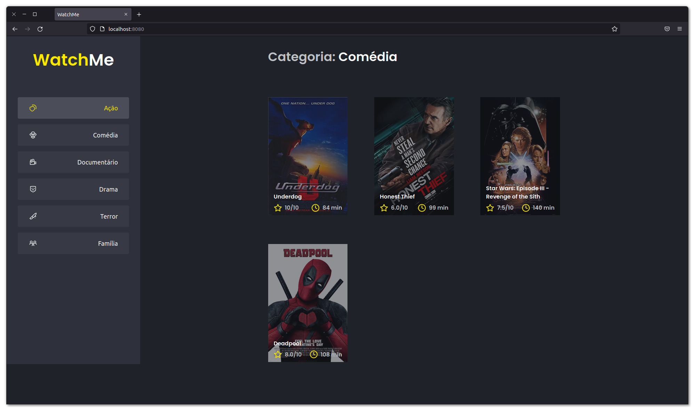
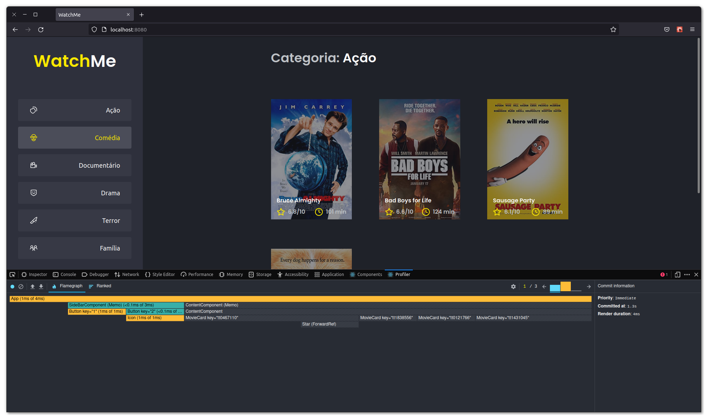
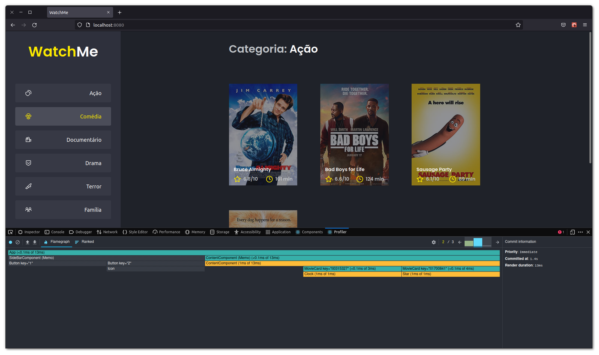
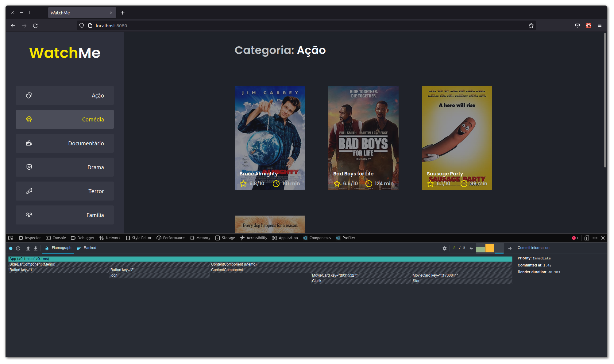

  

    
  

  <h4 align="center">Plataforma web para assitir filmes e séries.</h4>

## Resumo

  <ol>
    <li><a href="#visão-geral-do-projeto">Visão geral do projeto</a></li>
    <li><a href="#sobre-o-projeto">Sobre o projeto</a></li>
    <li><a href="#tecnologias-utilizadas">Tecnologias utilizadas</a></li>
    <li><a href="#instalação-e-utilização">Instalação e utilização</a></li>
  </ol>

## Visão geral do projeto

    
    
    
    

## Sobre o projeto

Plataforma web para assitir filmes e séries. Projeto utilizado para treinar os 
conhecimentos adquiridos no módulo de performance com ReactJS, do Ignite da Rockeseat.

* [Link do Desafio](https://efficient-sloth-d85.notion.site/Desafio-01-Otimizando-a-aplica-o-2942004b422d455891756300d88d0b9a)

## Tecnologias utilizadas

As principais tecnologias utilizadas na construção deste projeto foram: 

* [React.JS](https://github.com/facebook/react)
* [Json Server](https://www.npmjs.com/package/json-server)
* [React Dev Tools](https://chrome.google.com/webstore/detail/react-developer-tools/fmkadmapgofadopljbjfkapdkoienihi?hl=en)

## Instalação e utilização

Instruções de instalação do projeto em seu computador.

### Pré-requisitos 

Instalações necessárias antes de executar o projeto.

1. Node
2. Yarn
3. React Dev Tools
  
### Instalação

1. Baixe as dependências do projeto com o comando `$ yarn`.
2. Execute a Api fake com o comando `$ yarn server`. -> localhost:3333
3. Execute o projeto com o comando `$ yarn dev`. -> localhost:8080

 

<h4 align="center"><a href="#top">Voltar ao Início</a></h4>